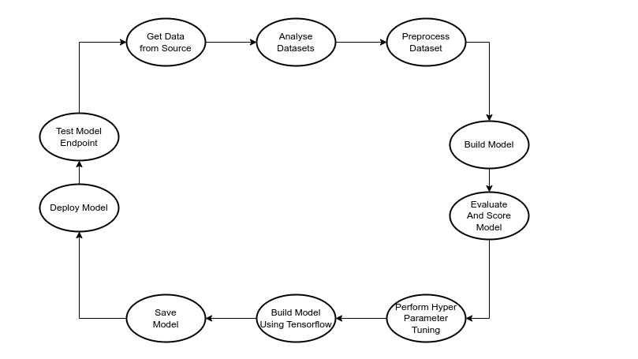

## Title
Medical Cost Prediction Using Machine Learning

### Problem Statement
Many people in the world don't take into account their health. They live their life anyhow they won't without thinking of what may happen to them or their loved ones. Will all these people be able to afford their medical costs in case something worse or bad happens to them in order to save their lives? the `AIM` of this project is to build a predictive model to help individuals predict their medical cost in case something bad happen to them. By doing so, individuals will start to advise themselves on how to live their lives.

### Objectives
* To collect dataset.
* Train model to predict medical charges.

### Functional Requirements
* Allow Access To Model API
* Predict and return medical charges

### Software Requirements
* Python3.10 packages

| Packages Names | Version Number |
| ---------------|--------------- |
| Pandas         | 0.23.4         |
| Numpy          | 1.15.1         |
| Matplotlib     | 2.2.3          |
| Seaborn        | 0.9.0          |
| Notebook       | 0.19.2         |
| Scikit Learn   | 5.6.0          |

* Docker / Dockerhub
* Git / Github
* Azure CLI
* Vscode

### Hardware Requirements
* Ubuntu 22.04
* 16 Gig Ram
* 1 Terabyte HDD

### Algorithms Experimented With
* Linear Regression
* Random Forest Regressor
* Decision Tree
* SVM
* LightGBM
* xGBoost
* Ridge Regression
* Lasso Regression
* KNN

### Evaluation Metrics Used
* R Squared
* Mean Absolute Error
* Mean Absolute Percentage Error

### Hyperpparameter Tuning Technique Used
* GridSearchCV
* RandomSearchCV

### Base Model
After building the base model by iterating through the algorithms bellow, `RandomForestRegressor` and `LightGBM` had a good accuracy score and a lower loss value compared to the other algorithms. Bello are the matrics for each alorithm used.

| Algorithm                 |MAE        |MAPE   |R2     |
| --------------------------|-----------|-------|-------|
|RandomForestRegressor      |2740.39    |0.294  |0.821  |
|DecisionTreeRegressor      |3329.762   |0.369  |0.638  |  
|KNeighborsRegressor        |3392.823   |0.391  |0.775  |
|LinearRegression           |4439.631   |0.423  |0.703  |
|LightGBM                   |2854.444   |0.302  |0.821  |
|Ridge                      |4443.001   |0.425  |0.704  |
|Lasso                      |4439.069   |0.423  |0.703  |
|SVR                        |7743.029   |0.867  |-0.103 |

After building the base model, hyperparameter tunning was performed on both `RandomForestRegressor` and `LightGBM` using `RandomizedSearchCV` and `GridSearchCV` with `Scikiltlearn Pipeline`. This is because their accuracy score were higher and loss value were lower compared to the other algorithms. 

### Cloud Platform Used
* Microsoft Azure
* Azure DevOps

The model was deployed on `Microsoft Azure`. The diagram bellow is the cloud architecture on azure resources used to run the model.

### Azure Resources Used
* Resource Group
* Container App Environment
* Containerapp
* Log Analytics Workspace
* Storage Account
* Managed Identity

### Azure DevOps Resources Used
* Yaml Pipeline
* Repos
* Board

The model was deployed to `Azure` using `Azure DevOps` CICD Yaml pipeline by building, testing and deploying. The diagram bellow represent how the model was released onto microsoft azure through azure devops yaml pipeline.

### Making Request To Model

### How model can be accessed

### Training Steps:
1. Retrieved Dataset.
2. Performed Exploratory Data Analysis.
3. Preprocess Dataset.
4. Build Base Model.
5. Evaluated Base Model
6. Perform Hyper-parameter Tuning.
7. Selected Best Model
8. Saved Model

The diagram bellow is a visual representation of how the entire model was built.

### Cost Involved
Since serverless technologies were used for the entire project life cycle, it cost **$ 0.00.**
| Azure Resource Name       | Price |
| --------------------------| ------|
| Container App             | $ 0.0 |
| Storage Account           | $ 0.0 |
| Log Analytics             | $ 0.0 |
| Resource Group            | $ 0.0 |
| Container App Environment | $ 0.0 |
| Total                     | $ 0.0 |

### Medium Article Explaining My Entire Process

Part 1: [Explains how the model was built](https://medium.com/@cloudwithdeb/medical-cost-prediction-using-machine-learning-microsoft-azure-and-azure-devops-part-1-629db04d51d9)

Part 2: [Explains how the model was exposed as an API](https://medium.com/@cloudwithdeb/medical-cost-prediction-using-machine-learning-microsoft-azure-and-azure-devops-part-2-b49b23c06b41)

Part 3: [Explains how the model was deployed using infrastructure as code and CICD pipelines with Azure and Azure DevOps](https://medium.com/@cloudwithdeb/medical-cost-prediction-using-machine-learning-microsoft-azure-and-azure-devops-part-3-719ea91789ec)
